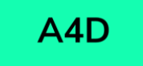
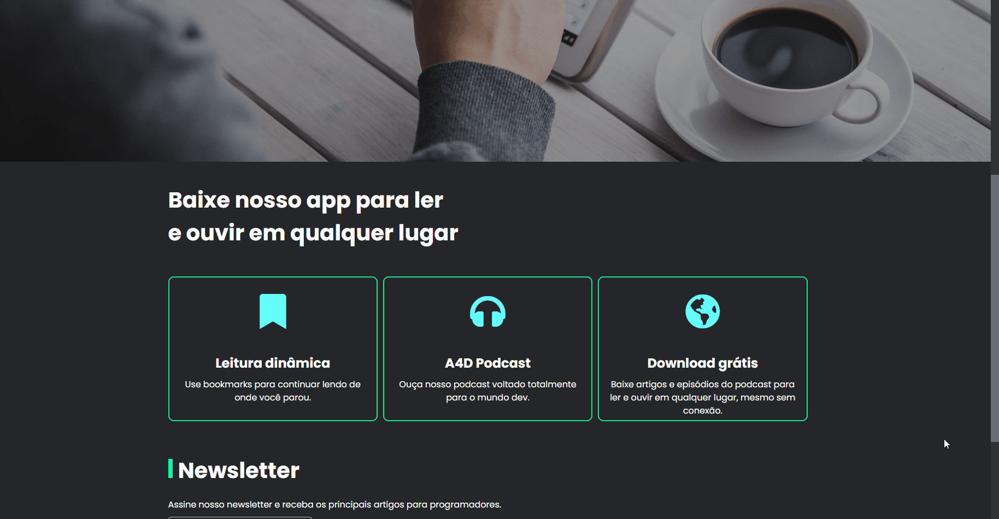

## Sobre
Website de artigos sobre tecnologia feito em VueJS e consumindo a API A4d-backend via Axios.
<br/>

<div style="display: inline_block"><br>
    
    
    
    
</div>
<br/>

## Status do projeto
<h4> 
	🚧 A4D 🚀 Em construção... 🚧
</h4>
<br/>

## Demonstração
<b>Clique <a href="https://a4d-project.herokuapp.com/">aqui</a> para acessar o site</b>
<br/><br/>

<br/><br/>

## Project setup
```
npm install
```

### Compiles and hot-reloads for development
```
npm run serve
```

### Compiles and minifies for production
```
npm run build
```

<br/>
Baixe o <a href="https://git-scm.com/">GIT</a>, <a href="https://nodejs.org/en/">NodeJS</a> e <a href="https://cli.vuejs.org/">Vue CLI</a> na sua máquina.
<br/><br/>
<b>Autor:</b> <a href="https://beacons.ai/danvinicius">Daniel Vinícius</a>
